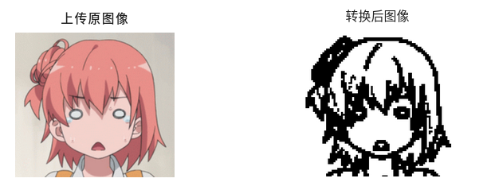
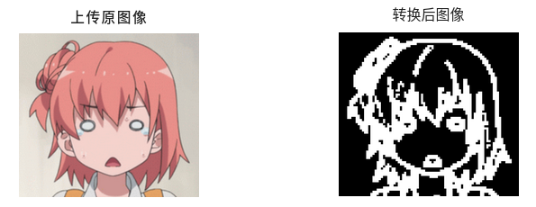
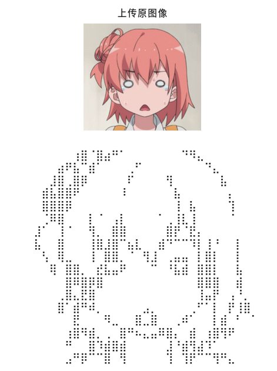
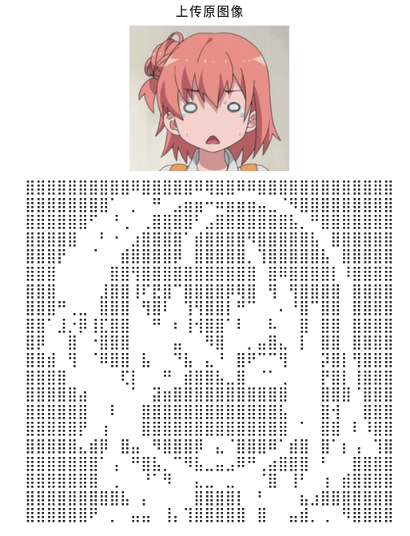

# pixel-image
[click here to preview](https://YiKang-Sun.github.io/Pixel-Text-Image/dist/)
## Display  
### to black-white  
  
### to black-white reverse  
  
### to colorful  
  
### line style 
  
### line style reverse
   
### to text  
  
### to text reverse  
    
### text line style  
  
### text line style reverse
  

## Project setup
```
npm install
```

### Compiles and hot-reloads for development
```
npm run serve
```

### Compiles and minifies for production
```
npm run build
```

### Lints and fixes files
```
npm run lint
```

### Customize configuration
See [Configuration Reference](https://cli.vuejs.org/config/).
